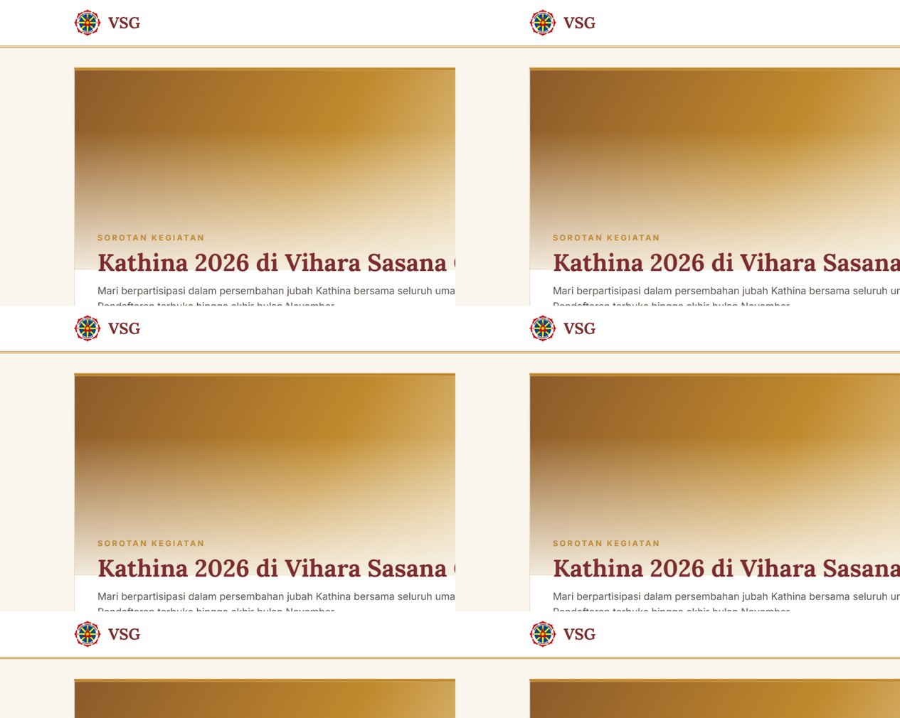
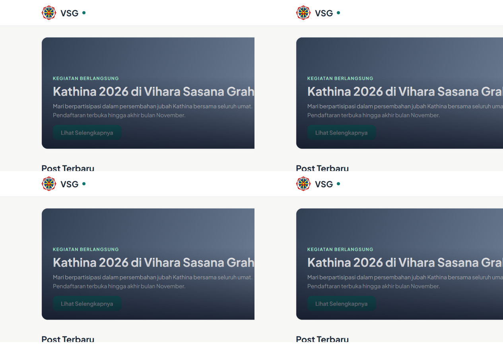
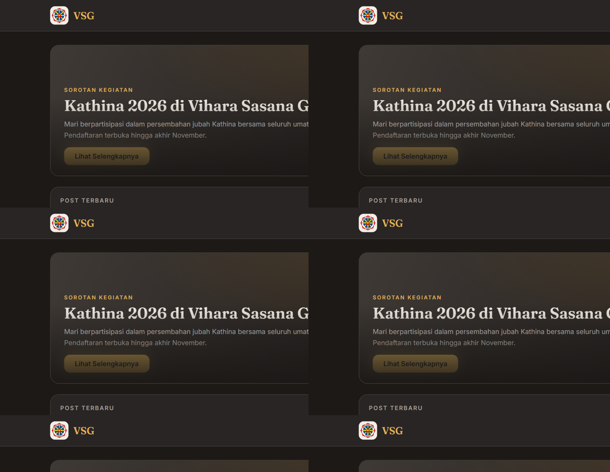

# Public Pages Design Redesign Plan

Status: **Approved — Option B "Zen Minimal" selected (2026-08-22)**

---

## 1. Website Context

**VSG iApp** is the official app of *Vihara Sasana Graha, Nunukan* (North Kalimantan, Indonesia) — a Buddhist temple app that doubles as a public website, member area, and admin CMS. Content is in Indonesian. It ships as an installable PWA (offline support, service worker caching, install banner).

### Public pages in scope

| Route | Content | Notes |
|---|---|---|
| `/` | Campaign banner carousel (Swiper) + latest posts grid with infinite scroll | Landing page |
| `/paritta` | 16 Buddhist chanting tracks (Namakara Gatha → Ettavatta), custom audio player, playlist, loop modes, sticky mobile controls | Heavily used, offline-cached audio |
| `/gallery`, `/gallery/album/[slug]` | Photo album archive | Grid of album cards |
| `/post/[slug]` | Article detail (Slate rich text serialized to HTML) | Long-form reading |
| `/campaign/[slug]` | Campaign/banner detail | Often opened from social media |
| `/signin`, `/profile` | Auth pages | Simple forms |

### Current design audit ("soft pastel glass")

- **Palette**: soft blue `#7ea7cb` primary, warm gold `#f2d9a4` secondary, pastel tints (`#c8dded`, `#edf4fa`), slate grays for text. Background is a pale vertical gradient (`#f5f9fd → #f9f7f0 → #fff`).
- **Typography**: Raleway for everything (Roboto is also loaded but barely used). Uppercase letterspaced micro-labels ("Latest Updates", "Photo Archive").
- **Components**: white/85 glass cards (`backdrop-blur`), `rounded-3xl`, soft shadows, pastel gradient strips on card tops, decorative blurred color circles.
- **Navigation**: mobile = floating bottom glass bar with a blue→gold gradient; desktop = top gradient bar. PWA install banner + service-worker update toast.
- **CSS setup**: Tailwind was removed; `src/styles/utilities.css` (2,460 lines) is a static utility-class copy. Design tokens live in `globals.css` CSS variables + `antd-theme.ts` (antd is used mainly in admin; public pages are mostly custom UI).

### Problems to solve

1. The pastel glass style reads "generic startup landing", not "Buddhist temple" — no cultural identity.
2. Gold and blue compete everywhere; there is no clear primary. Hierarchy relies on soft shadows that disappear on low-quality screens.
3. Raleway at small sizes is thin; long post bodies and Pariti track lists could be more readable (audience includes older congregation members).
4. The Paritta player — the app's signature feature — looks like a generic playlist instead of something special.

---

## 2. Goals & Constraints

**Goals**

- A distinctive identity appropriate for a vihara, while staying clean and modern.
- Better readability for long-form posts and the Paritta playlist.
- Give the Paritta player a signature look.
- Keep mobile-first PWA behavior (bottom nav, offline, install prompt) intact.

**Constraints (must keep)**

- Plain CSS stack: extend `globals.css` tokens + static `utilities.css`. Do **not** reintroduce Tailwind or add a CSS-in-JS library.
- Keep existing page structure and components (`Navigation`, `Footer`, `Container`, `Post`, `InfiniteScrollTrigger`) — restyle, don't rebuild.
- Admin pages keep antd and are **out of scope** (public pages only). `antd-theme.ts` only needs alignment where public pages use antd (toasts, modals).
- No new runtime dependencies (fonts via Google Fonts, same as now).
- Indonesian UI copy stays as-is.

---

## 3. Design Options

### Option A — "Heritage" (Warm Traditional Editorial)

Serious, warm, and unmistakably a temple site. Feels like a well-set dharma bulletin: ivory paper, temple red, saffron gold accents, serif headlines.

**Palette**

| Token | Value | Use |
|---|---|---|
| `--bg` | `#FAF6EE` (ivory) | Page background, flat (no gradient) |
| `--surface` | `#FFFFFF` | Cards |
| `--primary` | `#7C2D2D` (temple red / maroon) | Headings, links, active nav |
| `--accent` | `#C08A2D` (saffron gold) | Highlights, rules, hover states |
| `--accent-soft` | `#F3E6C9` | Chips, selected states |
| `--text` | `#292524`, `--text-muted` `#78716C` | Body / secondary |

**Typography**

- Headings: **Lora** (serif, 600/700) — gives the ceremonial voice.
- Body/UI: **Inter** (400/500/600) — neutral, highly readable at small sizes.
- Keep the uppercase micro-labels but recolor to gold `#C08A2D`.

**Visual language**

- Flat ivory background; cards are plain white with a **1px warm border** (`#EADFC8`) and a **4px saffron top rule** replacing the pastel gradient strip.
- Decorative element: a thin gold double rule under section titles (inspired by temple manuscript borders). No blurred blobs.
- Radius reduced to `rounded-2xl` (16px); shadows minimal (`0 1px 2px`), reserved for hover.
- Banner: full-bleed image with an ivory gradient scrim, serif title, gold "Lihat Selengkapnya" button.
- **Paritta player**: card framed with a subtle gold border; current track marked with a lotus marker ▸ and saffron tint; big circular red-gold play button.
- Post detail: measure article body to ~70ch, Lora for pull quotes.

**Pros / Cons**

- ✅ Strongest cultural identity; warm and respectful; excellent text hierarchy; easy on older eyes.
- ✅ Palette still distinguishes cleanly from the antd admin blue (admin untouched).
- ⚠️ Biggest visual departure — all public pages get touched.
- Effort: **Medium** (mostly token + card/class swaps; utilities.css additions small).

---

### Option B — "Zen Minimal" (Modern Mindfulness App) — *SELECTED ✅*

A disciplined evolution of the current site: calmer, flatter, one clear accent. Feels like a meditation app (Calm/Headspace family) rather than a pastel landing page. Lowest-risk path.

**Palette**

| Token | Value | Use |
|---|---|---|
| `--bg` | `#F7F7F5` (warm stone) | Page background, flat |
| `--surface` | `#FFFFFF` | Cards |
| `--primary` | `#0F766E` (jade teal) | Single accent: links, active nav, primary buttons |
| `--primary-soft` | `#E6F2F0` | Selected states, chips |
| `--text` | `#1F2937`, `--text-muted` `#6B7280` | Body / secondary |
| `--border` | `#E5E7EB` | 1px borders everywhere shadows used to be |

**Typography**

- Everything: **Plus Jakarta Sans** (400/500/600/700) — an Indonesian typeface, fitting for an Indonesian temple app, excellent at small sizes.
- Same scale as now; drop letterspacing on micro-labels to `0.12em` for a quieter look.

**Visual language**

- Flat stone background, no gradient, no blobs, no glassmorphism.
- Cards: white, 1px `--border`, `rounded-2xl`, **no default shadow — shadow appears on hover only** (`0 4px 16px rgba(0,0,0,0.06)`).
- Bottom/top nav becomes a clean solid white bar with jade active pill; brand logo gets a jade accent.
- Banner: simpler — dark scrim + white text + jade button; remove the pastel top strip.
- **Paritta player**: playlist rows become a clean list with a jade progress indicator; play button = solid jade circle; now-playing row gets `--primary-soft` background.
- Skeletons and empty states follow the same flat language (already close).

**Pros / Cons**

- ✅ Least effort — same layout skeleton, mostly class/token changes; utilities.css already covers most classes needed.
- ✅ Unambiguous hierarchy; best raw readability; modern PWA app feel.
- ✅ Plus Jakarta Sans = subtle local identity win.
- ⚠️ Least "traditional temple" character of the three; identity carried more by content than decor.
- Effort: **Low**.

---

### Option C — "Ceremonial Night" (Immersive Dark Mode)

The boldest: a warm candlelit dark theme built around the Paritta listening experience — charcoal browns, glowing gold, image-forward heroes. Public pages only (admin stays light).

**Palette**

| Token | Value | Use |
|---|---|---|
| `--bg` | `#1C1917` (warm charcoal) | Page background |
| `--surface` | `#292524` | Cards |
| `--surface-2` | `#33302B` | Raised elements (player, playlist rows) |
| `--primary` | `#E0B45C` (candle gold) | Buttons, links, active states |
| `--primary-glow` | `rgba(224,180,92,0.25)` | Focus rings, now-playing glow |
| `--text` | `#F4EFE6` (cream), `--text-muted` `#A8A29E` | Body / secondary |

**Typography**

- Headings: **Fraunces** or **Lora** (serif with warm personality).
- Body/UI: **Inter**. Slightly larger base size (16–17px) since dark text runs longer.

**Visual language**

- Surfaces separated by elevation (`--surface` vs `--surface-2`), not shadows.
- Gold used sparingly and decisively: primary buttons, active nav, now-playing state, focus rings.
- Banner: cinematic full-bleed image, gradient into `--bg`, cream serif title.
- **Paritta player is the centerpiece**: large gold circular play button with a soft glow when playing, animated equalizer bars on the active track, playlist with gold now-playing highlight. Optionally a faint lotus line-art watermark.
- Gallery: images pop on dark; cards get thin `#44403C` borders and hover gold outline.
- Post detail: cream-on-charcoal body at ~70ch; blockquotes get a gold left rule.

**Pros / Cons**

- ✅ Most distinctive and memorable; perfect stage for Paritta; great on OLED phones; photos look dramatically better.
- ⚠️ Highest effort: every public page + skeletons + toasts need dark variants; long-form reading in dark mode divides opinion; needs a careful contrast pass (older users).
- ⚠️ Content images (post banners) vary in exposure — need consistent borders/scrims.
- Effort: **High**.

---

## 4. Comparison

| Criterion | A — Heritage | B — Zen Minimal | C — Ceremonial Night |
|---|---|---|---|
| Temple identity | ★★★ | ★★ | ★★★ |
| Readability (posts, playlist) | ★★★ | ★★★ | ★★ |
| Effort / risk | Medium | **Low** | High |
| Paritta player impact | ★★ | ★★ | ★★★ |
| Departure from current | Large | Small | Very large |
| Older-user friendliness | ★★★ | ★★★ | ★★ |

**Recommendation: Option B.** It fixes the concrete problems (muddled palette, weak hierarchy, small-size readability) with the least risk to a working PWA, and its jade-plus-editorial-content look still reads calm and "temple-adjacent". A and C can be adopted partially later (e.g. C's gold Paritta styling as an accent within B).

---

## 5. Implementation Plan (applies to the chosen option)

CSS-only restyle; no structural rebuilds. Phases land independently and each is shippable.

**Phase 0 — Tokens & fonts**
1. Replace `:root` variables in `src/styles/globals.css` with the chosen palette; set body background/typography.
2. Swap the Google Fonts import (drop Raleway; remove the unused Roboto link in `src/app/layout.tsx`).
3. Align `src/styles/antd-theme.ts` tokens (primary, borders, radius) so antd toasts/modals on public pages match.
4. Add any missing static utilities to `src/styles/utilities.css` following existing naming (check with a grep before adding).

**Phase 1 — Shell**
1. `Navigation` (top bar, bottom bar, active states) and PWA install banner.
2. `Footer` (drop gradient strip; recolor per option).
3. `Container` spacing.
4. Update `viewport.themeColor` in `layout.tsx` and `public/manifest.json` `theme_color`/`background_color` to match.

**Phase 2 — Home**
1. Banner section (scrim, button, remove pastel strips/blobs).
2. `Post` card (`src/components/display/post.tsx`): border/shadow treatment, hover, CTA button.
3. Post skeletons.

**Phase 3 — Content pages**
1. `/post/[slug]`: header block + article body classes in the `serialize()` HTML strings.
2. `/gallery` + album page: album cards, image grid.
3. `/campaign/[slug]`, `/signin`, `/profile`, `not-found`.

**Phase 4 — Paritta player**
1. Desktop player card + mobile sticky controls.
2. Playlist rows, now-playing state per chosen direction.

**Phase 5 — Polish & verify**
1. Contrast check (WCAG AA) on text over images and scrims.
2. Test PWA: offline paritta page, install banner, SW-update toast styling.
3. `@media print` rules still correct (deceased print view uses them).
4. Lighthouse pass on `/` and `/paritta`; verify no layout shift from font swap (`display=swap`, preconnect).

**Out of scope:** admin pages, antd component restyling beyond tokens, content changes, new features.
